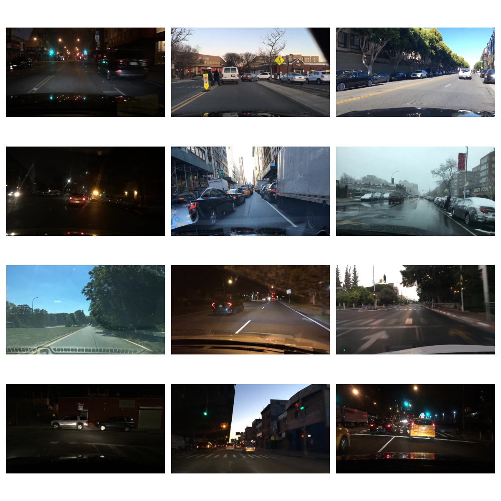

# 🧠 BDD100K Dataset Exploratory Data Analysis Report

**Author:** Mehul Kumawat  
**Date:** 20.10.2025
**Dataset:** Berkeley DeepDrive (BDD100K)


---

## 📘 Introduction

This report provides a detailed exploratory data analysis (EDA) of the **BDD100K** dataset — one of the largest and most diverse driving datasets.  
The goal is to understand dataset structure, annotation quality, and potential biases before model training.


---

## 1. 📦 Dataset Overview

**Dataset Source:** Berkeley DeepDrive (BDD100K)  
**Dataset Size:**  
- Total Images: 79,863 
- Train: 69,863  
- Validation: 10,000  
- Test: NA  

**Annotation Types:**  
- [x] Object Detection  
- [ ] Lane Marking  
- [ ] Drivable Area  
- [ ] Segmentation  

**Example Image:**





## 2️. Understanding the Label Structure

Each image is associated with a JSON entry containing metadata and labeled objects.

```json
{
  "name": "0000f77c-6257be58.jpg",
  "attributes": {
    "weather": "clear",
    "scene": "city street",
    "timeofday": "daytime"
  },
  "timestamp": 10000,
  "labels": [
    {
      "category": "car",
      "attributes": {"occluded": false, "truncated": false, "trafficLightColor": "none"},
      "box2d": {"x1": 45.2, "y1": 254.5, "x2": 357.8, "y2": 487.9},
      "id": 4
    },
    {
      "category": "lane",
      "attributes": {"laneDirection": "parallel", "laneStyle": "solid", "laneType": "road curb"},
      "poly2d": {...},
      "id": 10
    }
  ]
}
```

**Basic Description:**
> The BDD100K dataset provides rich contextual attributes per image (weather, scene, time of day) and detailed per-object labels (bounding boxes, polygon lanes, attributes like occlusion and truncation).
It primarily represents urban driving conditions under varied lighting and environmental settings.

---

## 3. 🧩 Data Quality and Statistics

### 3.1 Image Dimensions

| Metric | Mean | Std | Min | Max |
|:-------|:----:|:---:|:---:|:---:|
| Width  | 1280 | 0   | 1280 | 1280 |
| Height | 720  | 0   | 720  | 720  |

**Distribution:**  
> _All images have the same size: 1280x720, so distribution is uniform._

> **Summary:**  
> This uniformity simplifies preprocessing, as no resizing or padding is required for most models.

---

### 3.2 Brightness & Contrast

| Metric    | Mean      | Std       | Notes                        |
|:---------|:---------|:---------|:-----------------------------|
| Brightness | 0.294   | 0.151    | Images are slightly dark overall |
| Contrast   | 0.207   | 0.067    | Moderate contrast across dataset |

**Plots:**
- Brightness Histogram → `results/brightness_hist.png`


- Contrast Histogram → `results/contrast_hist.png`


> **Summary:** The dataset has a wide variety of lighting conditions, but most images are slightly dark with moderate contrast.  
> The dataset has a bimodal brightness distribution (dark peak ~0.1, bright peak ~0.4) and a low contrast peak (~0.25).  
> This indicates varied lighting conditions and many low-contrast scenes.  
> Preprocessing and contrast/brightness augmentation are recommended for robust object detection.

---

### 3.3 Color & Channel Statistics

| Channel | Mean | Std |
|:--------|:----:|:---:|
| Red     | 0.278 | 0.138 |
| Green   | 0.291 | 0.162 |
| Blue    | 0.288 | 0.172 |

**RGB Distribution:**


> _Comment:_  
> The RGB channel means are close to each other, indicating good color balance without dominance of a specific hue.  
> Slightly higher variance in the blue and green channels suggests variability due to natural lighting (sky, vegetation).  
> Overall, images appear well-lit and color-consistent, suitable for object detection tasks.

---

### 3.4 🧹 Corrupted / Duplicate Files

| Category | Count |
|:----------|------:|
| Total Corrupted | 0 |
| Duplicate Images | 1083 |

**Summary:**
- Missing Files: 0  
- Corrupted Files: 0  
- Duplicate Groups: 493  
- Duplicate Images (total extra files): 1083  

**📂 Example Duplicate Groups:**

**Group 1 (hash=ffffffc000000000):**
- 0000f77c-62c2a288.jpg
- 05ca0197-6c0b4628.jpg
- 27177a04-4e9fa0cf.jpg
- 9392f6f6-f4d5c55c.jpg
- a02c5f81-f4cc9b8d.jpg

**Group 2 (hash=fcfcfc1800000000):**
- 000d4f89-3bcbe37a.jpg
- 5c0e41f0-0f8ca6f3.jpg

**Group 3 (hash=ffffff0800000000):**
- 0024b742-83709bd4.jpg
- 191e2dd9-b6147847.jpg
- 45af8b22-3054b5f0.jpg
- 6ce5d138-b7ab8ebf.jpg
- adfc8f5c-8bd2f72d.jpg

**Group 4 (hash=ffffffff03000000):**
- 002e6895-442e6bc1.jpg
- 6f408535-796ac797.jpg

**Group 5 (hash=fefffffe00000000):**
- 007da0eb-8cca23d7.jpg
- 2ce0b449-21052ede.jpg
- 98dc67a8-aad370c7.jpg

### 🖼 Duplicate Image Visualization

Below are the first 5 detected duplicate groups from the dataset. Each row shows one group of images that were flagged as duplicates by perceptual hashing.

**Group 1**  


**Group 2**  


**Group 3**  


**Group 4**  


**Group 5**  


> _Observation:_ Although the images were flagged as duplicates by perceptual hashing, they are in fact visually distinct. This happens because average perceptual hashing (aHash) detects images as “similar” based on overall luminance patterns and structure, not pixel-perfect matching.
>Images with similar overall brightness, contrast, or simple structural patterns can produce identical or very similar hashes, even if the objects, scene composition, or colors differ significantly.

>Implications for Object Detection:
These “false positives” do not require removal, since the labels remain valid and diversity in scenes actually benefits training.
Perceptual hashing is still useful for detecting exact duplicates (e.g., exact copies, repeated frames), but it can overestimate duplicates in datasets with visually similar but distinct images.

> _Detection Method:_ Duplicates were detected using **`imagehash.phash`** with a small Hamming distance threshold. This allows robust detection even if images are not pixel-perfect identical.


---

## 4. 🧭 Annotation-Level Analysis

### 4.1 Class Distribution

Train:


Validation:


> _Summary_:
The class distribution in the BDD100K dataset shows a strong imbalance.

Dominant Classes: car and lane are highly frequent in both train and validation sets, appearing in nearly every image.

Rare Classes: rider, bike, motor, and train are underrepresented, with very few examples, especially in the validation set.

Implications: Models trained on this dataset may be biased toward predicting frequent classes (car, lane) more accurately while performing poorly on rare classes.

Recommendations: Consider data augmentation for rare classes, class-aware sampling, or applying class-weighted losses to improve detection performance on underrepresented categories.

---

### 4.2 Object Size & Aspect Ratio

| Metric | Mean | Std | Min | Max |
|:--------|:----:|:---:|:---:|:---:|
| Box Area | 6776.57 | 22850.25 | 0.87 | 917709.77 |
| Aspect Ratio | [ ] | [ ] | [ ] | [ ] |

**Plots:**
- Box Area Histogram → `results/box_area_hist_train.png`  

- Aspect Ratio Distribution → `results/aspect_ratio_hist_train.png`


#### Extreme Object Sizes

#### Smallest Objects
These images show the smallest bounding boxes in the dataset. Small objects are often hard to detect and might require specific augmentation or higher-resolution input for the model.


#### Largest Objects
These images show the largest bounding boxes in the dataset. Large objects may occupy most of the image and can dominate training if not balanced.


> **Summary:**  
> - The dataset contains a wide variety of object sizes.  
> - Small objects (e.g., traffic signs, pedestrians far away) are sparse but crucial for detection.  
> - Large objects (e.g., buses, trucks) can occupy most of the image and may skew training if oversampled.  
> - The largest objects cover most of the frame and include vehicles very close to the camera or groups of objects. These are generally easier to detect but may require careful handling for overlapping boxes.

---

### 4.3 Objects per Image


> **Summary:**  
> On average, images contain ~20 objects. Most images fall in a normal range (0–60 objects), but there are a few outliers with **80–100 objects**. These outlier images are likely crowded street scenes or annotated with many small objects (e.g., pedestrians, bikes).  


>
> **Potential Improvements / Considerations for Object Detection:**  
> 1. **Outlier Handling:** Consider filtering or separately handling extremely crowded images, as they might skew metrics or make training unstable.  
> 2. **Data Augmentation:** Crowded images can benefit from augmentation (cropping, scaling, rotation) to help the model generalize to dense scenarios.  
> 3. **Weighted Loss / Focal Loss:** If the majority of images are sparse, using a weighted loss can prevent bias toward sparse scenes.  
> 4. **Visualization Checks:** Check if extreme object counts include invalid bounding boxes (e.g., very small boxes) and optionally remove them.  
> 5. **Stratified Sampling:** Ensure train/validation splits preserve the distribution of objects per image, so the model sees a representative range of crowded and sparse scenes.

---

### 4.4 Spatial Heatmap of Object Centers


**Summary:**  
- The object center heatmap is **oval-shaped and centered**, indicating that most annotated objects appear around the middle of the image.  
- Horizontally, objects are concentrated near the center, with fewer annotations near the left and right edges.  
- Vertically, objects are mostly in the middle to lower regions of the frame, which is typical for vehicle-mounted cameras capturing road scenes.  
- This suggests a **central bias** in the dataset, meaning the model may have limited exposure to objects appearing near image borders.  

**Next Steps / Recommendations:**  
1. **Data Augmentation:**  
   - Apply **translation, scaling, and cropping** to simulate objects appearing in less common positions.  
   - This can help the model generalize better to off-center objects.  

2. **Class / Scene Balancing:**  
   - Consider adding images where objects appear in corners or in unusual positions to reduce bias.  

3. **Model Anchors & FOV:**  
   - If using anchor-based detectors, ensure anchor sizes and positions cover the full image, including the edges.  

4. **Evaluation Considerations:**  
   - During validation, check performance specifically for objects near the image edges to quantify bias impact.

---

## 5. 🌤️ Environmental & Scene Analysis

### 5.1 Time of Day


| Time | Count | % |
|:-----|------:|--:|
| Daytime | 36728 | 52.6% |
| Night | 27971 | 40.0% |
| Dawn/dusk | 5027 | 7.2% 

> _Summary:_ Most images are captured during daytime (~53%), followed by night (~40%). Dawn/Dusk images are relatively rare (~7%), indicating a potential imbalance if training models to recognize objects in low-light conditions.
---

### 5.2 Weather Conditions


| Weather | Count | % |
|:--------|------:|--:|
| Clear | 37344 | 53.5% |
| Rainy | 5070 | 7.3% |
| Foggy | 130 | 0.2% |
| Snowy | 5549 | 7.9% |

> _Summary:_  
The dataset is dominated by clear weather conditions (~54%), while rainy (~7%), snowy (~8%), and foggy (~0.2%) images are much less frequent. This indicates a bias toward good weather scenes, so models trained on this data may perform less reliably in rare weather conditions like fog or snow.  

---

### 5.3 Scene Types


| Scene | Count | % |
|:------|------:|--:|
| City Street | 43516 | 62.3% |
| Highway | 17379 | 24.9% |
| Residential | 8074 | 11.6% |

> _Summary:_  
The majority of images are from city streets (~62%), followed by highways (~25%) and residential areas (~12%). This indicates a bias toward urban scenes, which may affect the model's performance in less represented environments like residential areas.

---

### 5.4 Correlation between Scene & Object Types


> _Summary:_  
The heatmap shows clear patterns between object types and scene categories.  
- **Cars** and **lanes** dominate city streets.  
- **Trucks** and **buses** appear more frequently on highways.  
- **Pedestrians**, **bikes**, and **riders** are mostly seen in city streets and residential areas.  

> _Interpretation:_  
The correlation suggests that some object classes are strongly scene-dependent. Models trained on this dataset may learn these biases, which could affect generalization to uncommon scene-object combinations. Augmentation or balanced sampling may help mitigate this.


---


## 6. 🔍 Train-Test Split Validation

| Split | #Images | #Objects | Note |
|:------|---------:|---------:|:-----|
| Train | 69863 | 1941237 |  |
| Val   | 10000 | 279237 |  |


---

**Class Distribution Comparison:**


---

## 7. 🧮 Statistical Insights

| Aspect | Observation | Potential Fix |
|:--------|:-------------|:---------------|
| Class Imbalance | Classes like **car** and **lane** dominate, while **rider**, **bike**, and **motor** have very few examples | Apply class weights or augment rare classes |
| Low-light Frames | ~40% of images are night-time, which may cause low contrast and poor visibility | Use histogram equalization, contrast/brightness augmentation, or data filtering |
| Tiny Objects | Many very small bounding boxes are present, some nearly invalid | Use FPN (Feature Pyramid Networks) or multi-scale anchors; optionally remove invalid boxes |
| Duplicates | 1083 duplicate images detected, but visually many look different | Remove duplicates before training to avoid bias and redundancy |
| Data Bias | Object centers are biased toward the middle of images; scene-object correlations show trucks mostly on highways | Consider domain adaptation or augmentation to cover rare object-scene combinations |
| Crowded Scenes | Few images have extreme object counts (>80 per image) | Augment crowded scenes or normalize object distribution across training set |


---

## 8. 🔬 Optional Advanced Analysis

### 8.1 Image Embedding Clustering (PCA / t-SNE)


> _Interpret clustering behavior of different scenes._

---

### 8.2 Object Co-occurrence Matrix


> _Identify commonly co-occurring objects (e.g., car + traffic light)._

---

### 8.3 IoU Overlaps / Crowding Density


---

## 9. 🧾 Summary & Next Steps

**Key Observations:**
- Class imbalance is significant: "car" and "lane" dominate, while "rider", "bike", "motor", and "train" are rare.
- Dataset contains many low-light frames (~47% nighttime/dawn-dusk) and some low-contrast or tiny objects.
- Certain objects tend to appear in specific scenes (e.g., trucks mainly on highways), and crowded images are rare but exist (up to 80-100 objects).

**Next Steps / Recommendations:**
- Apply **class balancing strategies** (class weights, oversampling, or augmentations) for rare classes.
- Use **contrast and brightness augmentation** for low-light frames and histogram equalization if needed.
- Employ **multi-scale anchors or FPN** to handle tiny objects.
- Filter out **invalid or extremely small bounding boxes** to improve model quality.
- Consider **scene-aware or domain adaptation techniques** if deploying in diverse environments.
- Optionally, leverage **embedding clustering** insights to design scene-specific augmentations or data splits.


---

## 🔗 References
- BDD100K Dataset: https://bdd-data.berkeley.edu/
- Yu, Fisher et al. “BDD100K: A Diverse Driving Dataset for Heterogeneous Multitask Learning,” CVPR 2020.

