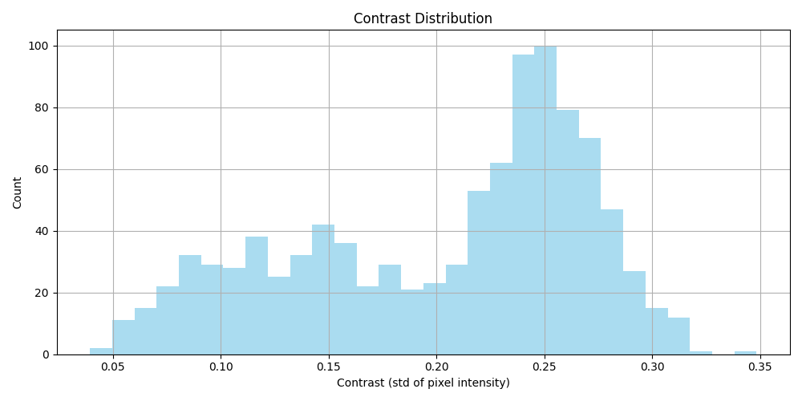
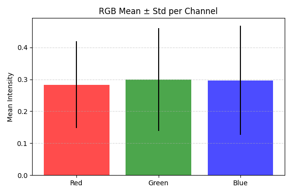

# 🧠 BDD100K Dataset Exploratory Data Analysis Report

**Author:** Mehul Kumawat  
**Date:** 20.10.2025
**Dataset:** Berkeley DeepDrive (BDD100K)


---

## 📘 Introduction

This report provides a detailed exploratory data analysis (EDA) of the **BDD100K** dataset — one of the largest and most diverse driving datasets.  
The goal is to understand dataset structure, annotation quality, and potential biases before model training.


---

## 1. 📦 Dataset Overview

**Dataset Source:** Berkeley DeepDrive (BDD100K)  
**Dataset Size:**  
- Total Images: 79,863 
- Train: 69,863  
- Validation: 10,000  
- Test: NA  

**Annotation Types:**  
- [x] Object Detection  
- [ ] Lane Marking  
- [ ] Drivable Area  
- [ ] Segmentation  

**Example Image:**


## 2️. Understanding the Label Structure

Each image is associated with a JSON entry containing metadata and labeled objects.

```json
{
  "name": "0000f77c-6257be58.jpg",
  "attributes": {
    "weather": "clear",
    "scene": "city street",
    "timeofday": "daytime"
  },
  "timestamp": 10000,
  "labels": [
    {
      "category": "car",
      "attributes": {"occluded": false, "truncated": false, "trafficLightColor": "none"},
      "box2d": {"x1": 45.2, "y1": 254.5, "x2": 357.8, "y2": 487.9},
      "id": 4
    },
    {
      "category": "lane",
      "attributes": {"laneDirection": "parallel", "laneStyle": "solid", "laneType": "road curb"},
      "poly2d": {...},
      "id": 10
    }
  ]
}
```

**Basic Description:**
> The BDD100K dataset provides rich contextual attributes per image (weather, scene, time of day) and detailed per-object labels (bounding boxes, polygon lanes, attributes like occlusion and truncation).
It primarily represents urban driving conditions under varied lighting and environmental settings.

---

## 3. 🧩 Data Quality and Statistics

### 3.1 Image Dimensions

| Metric | Mean | Std | Min | Max |
|:-------|:----:|:---:|:---:|:---:|
| Width  | 1280 | 0   | 1280 | 1280 |
| Height | 720  | 0   | 720  | 720  |

**Distribution:**  
> _All images have the same size: 1280x720, so distribution is uniform._

> **Summary:**  
> This uniformity simplifies preprocessing, as no resizing or padding is required for most models.

---

### 3.2 Brightness & Contrast

| Metric    | Mean      | Std       | Notes                        |
|:---------|:---------|:---------|:-----------------------------|
| Brightness | 0.294   | 0.151    | Images are slightly dark overall |
| Contrast   | 0.207   | 0.067    | Moderate contrast across dataset |

**Plots:**
- Brightness Histogram → `results/brightness_hist.png`


- Contrast Histogram → `results/contrast_hist.png`



> **Summary:** The dataset has a wide variety of lighting conditions, but most images are slightly dark with moderate contrast.  
> The dataset has a bimodal brightness distribution (dark peak ~0.1, bright peak ~0.4) and a low contrast peak (~0.25).  
> This indicates varied lighting conditions and many low-contrast scenes.  
> Preprocessing and contrast/brightness augmentation are recommended for robust object detection.

---

### 3.3 Color & Channel Statistics

| Channel | Mean | Std |
|:--------|:----:|:---:|
| Red     | 0.278 | 0.138 |
| Green   | 0.291 | 0.162 |
| Blue    | 0.288 | 0.172 |

**RGB Distribution:**


> _Comment:_  
> The RGB channel means are close to each other, indicating good color balance without dominance of a specific hue.  
> Slightly higher variance in the blue and green channels suggests variability due to natural lighting (sky, vegetation).  
> Overall, images appear well-lit and color-consistent, suitable for object detection tasks.

---

### 3.4 🧹 Corrupted / Duplicate Files

| Category | Count |
|:----------|------:|
| Total Corrupted | 0 |
| Duplicate Images | 1083 |

**Summary:**
- Missing Files: 0  
- Corrupted Files: 0  
- Duplicate Groups: 493  
- Duplicate Images (total extra files): 1083  

**📂 Example Duplicate Groups:**

**Group 1 (hash=ffffffc000000000):**
- 0000f77c-62c2a288.jpg
- 05ca0197-6c0b4628.jpg
- 27177a04-4e9fa0cf.jpg
- 9392f6f6-f4d5c55c.jpg
- a02c5f81-f4cc9b8d.jpg

**Group 2 (hash=fcfcfc1800000000):**
- 000d4f89-3bcbe37a.jpg
- 5c0e41f0-0f8ca6f3.jpg

**Group 3 (hash=ffffff0800000000):**
- 0024b742-83709bd4.jpg
- 191e2dd9-b6147847.jpg
- 45af8b22-3054b5f0.jpg
- 6ce5d138-b7ab8ebf.jpg
- adfc8f5c-8bd2f72d.jpg

**Group 4 (hash=ffffffff03000000):**
- 002e6895-442e6bc1.jpg
- 6f408535-796ac797.jpg

**Group 5 (hash=fefffffe00000000):**
- 007da0eb-8cca23d7.jpg
- 2ce0b449-21052ede.jpg
- 98dc67a8-aad370c7.jpg

### 🖼 Duplicate Image Visualization

Below are the first 5 detected duplicate groups from the dataset. Each row shows one group of images that were flagged as duplicates by perceptual hashing.

**Group 1**  


**Group 2**  


**Group 3**  


**Group 4**  


**Group 5**  


> _Observation:_ Although the images were flagged as duplicates by perceptual hashing, they are in fact visually distinct. This happens because average perceptual hashing (aHash) detects images as “similar” based on overall luminance patterns and structure, not pixel-perfect matching.
>Images with similar overall brightness, contrast, or simple structural patterns can produce identical or very similar hashes, even if the objects, scene composition, or colors differ significantly.

>Implications for Object Detection:
These “false positives” do not require removal, since the labels remain valid and diversity in scenes actually benefits training.
Perceptual hashing is still useful for detecting exact duplicates (e.g., exact copies, repeated frames), but it can overestimate duplicates in datasets with visually similar but distinct images.

> _Detection Method:_ Duplicates were detected using **`imagehash.phash`** with a small Hamming distance threshold. This allows robust detection even if images are not pixel-perfect identical.


---

## 4. 🧭 Annotation-Level Analysis

### 4.1 Class Distribution

Train:


Validation:


> _Summary_:
The class distribution in the BDD100K dataset shows a strong imbalance.

Dominant Classes: car and lane are highly frequent in both train and validation sets, appearing in nearly every image.

Rare Classes: rider, bike, motor, and train are underrepresented, with very few examples, especially in the validation set.

Implications: Models trained on this dataset may be biased toward predicting frequent classes (car, lane) more accurately while performing poorly on rare classes.

Recommendations: Consider data augmentation for rare classes, class-aware sampling, or applying class-weighted losses to improve detection performance on underrepresented categories.

---

### 4.2 Object Size & Aspect Ratio

| Metric | Mean | Std | Min | Max |
|:--------|:----:|:---:|:---:|:---:|
| Box Area | 6776.57 | 22850.25 | 0.87 | 917709.77 |
| Aspect Ratio | [ ] | [ ] | [ ] | [ ] |

**Plots:**
- Box Area Histogram → `results/box_area_hist_train.png`  

- Aspect Ratio Distribution → `results/aspect_ratio_hist_train.png`


---

### 4.3 Objects per Image


> _Comment if dataset has mostly crowded or sparse scenes._

---

### 4.4 Spatial Heatmap of Object Centers


> _Interpret if object centers are biased (e.g., vehicles always near bottom)._

---

## 5. 🌤️ Environmental & Scene Analysis

### 5.1 Time of Day


| Time | Count | % |
|:-----|------:|--:|
| Daytime | [ ] | [ ] |
| Night | [ ] | [ ] |
| Dawn/Dusk | [ ] | [ ] |

---

### 5.2 Weather Conditions


| Weather | Count | % |
|:--------|------:|--:|
| Clear | [ ] | [ ] |
| Rainy | [ ] | [ ] |
| Foggy | [ ] | [ ] |
| Snowy | [ ] | [ ] |

---

### 5.3 Scene Types


| Scene | Count | % |
|:------|------:|--:|
| City Street | [ ] | [ ] |
| Highway | [ ] | [ ] |
| Residential | [ ] | [ ] |

---

### 5.4 Correlation between Scene & Object Types


> _Interpret patterns (e.g., trucks mainly appear on highways)._

---

## 6. 🔍 Train-Test Split Validation

| Split | #Images | #Objects | Note |
|:------|---------:|---------:|:-----|
| Train | [ ] | [ ] |  |
| Val | [ ] | [ ] |  |
| Test | [ ] | [ ] |  |

**Class Distribution Comparison:**


> _Check if each subset is representative of overall data._

---

## 7. 🧮 Statistical Insights

| Aspect | Observation | Potential Fix |
|:--------|:-------------|:---------------|
| Class Imbalance | [ ] | Apply class weights or augment rare classes |
| Low-light Frames | [ ] | Use histogram equalization or data filtering |
| Tiny Objects | [ ] | Use FPN or multi-scale anchors |
| Duplicates | [ ] | Removed before training |
| Data Bias | [ ] | Consider domain adaptation |

---

## 8. 🔬 Optional Advanced Analysis

### 8.1 Image Embedding Clustering (PCA / t-SNE)


> _Interpret clustering behavior of different scenes._

---

### 8.2 Object Co-occurrence Matrix


> _Identify commonly co-occurring objects (e.g., car + traffic light)._

---

### 8.3 IoU Overlaps / Crowding Density


---

## 9. 🧾 Summary & Next Steps

**Key Observations:**
- [ ]  
- [ ]  
- [ ]  

**Next Steps:**
1. Data Cleaning / Balancing  
2. Augmentation Plan  
3. Model Preprocessing Decisions  
4. Training/Validation Strategy  

---

## 🔗 References
- BDD100K Dataset: https://bdd-data.berkeley.edu/
- Yu, Fisher et al. “BDD100K: A Diverse Driving Dataset for Heterogeneous Multitask Learning,” CVPR 2020.

